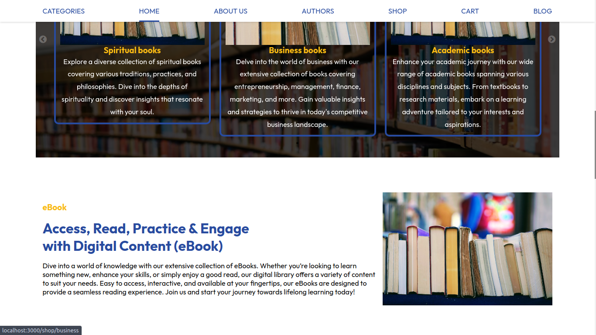

## `Online Bookstore Application` ##

This is a full-featured online bookstore application built with modern web technologies including React, CSS3, Node.js, MongoDB, and JWT for secure authentication. The application provides a seamless experience for administrators, authors, and customers, offering a wide range of functionalities to manage and purchase books, as well as read and manage blogs about books.

 
 
 
 
 

## Features

### 1. User Authentication
- **JWT Authentication**: Secure login and registration system using JSON Web Tokens (JWT).
- **Role-Based Access**: Separate dashboards and functionalities for admins, authors, and customers.

### 2. Book Management
- **Admin Panel**: Allows administrators to review and approve books uploaded by authors.
- **Book Listings**: Customers can browse through a wide selection of approved books, categorized for easy navigation.
- **Author Uploads**: Authors can upload their works, which are then reviewed by admins to ensure they meet legal and quality requirements.

### 3. Purchase and Reading
- **Secure Payment**: Integrated with PayPal and Mpesa Daraja API for seamless and secure transactions.
- **Reading Interface**: Customers can purchase books and read them directly within the system. The reading interface is designed to prevent copying or unauthorized distribution of the content.

### 4. Revenue Sharing
- **Author Earnings**: Once a book is purchased, the author receives a certain percentage of the sale.
- **System Commission**: The platform retains a percentage of the sale as a commission for facilitating the transaction.

### 5. Admin Features
- **Inventory Management**: Track and manage book inventory, including stock levels and pricing.
- **Order Management**: View and process customer orders efficiently.
- **User Management**: Manage customer and author accounts, including permissions and access levels.
- **Book Approval**: Review and approve books uploaded by authors, ensuring they meet legal and quality standards before they are made available for purchase.
- **Blog Management**: Admins can create, update, or delete blog posts that provide insights and discussions on various books and related topics.
- **Payment Records Management**: Track and manage all payment transactions and records to ensure transparency and accuracy.

### 6. Customer Features
- **User-Friendly Interface**: Intuitive design for easy browsing and purchasing of books.
- **Order History**: Customers can view their past purchases and access their digital library.
- **Profile Management**: Customers can update their personal information and payment methods.
- **Blog Reading**: Customers can read blog posts about books, reviews, and literary topics curated by the admin and authors.

### 7. Author Features
- **Profile Management**: Authors can manage their profiles and add biographical details.
- **Book Listings**: Authors can view the books they have published within the system.
- **Book Uploads**: Authors can upload new books, which are then reviewed and approved by admins.
- **Blog Contributions**: Authors can write and manage blog posts related to their works or literary discussions.
- **Earnings Management**: Authors can view their earnings from book sales, reflecting the percentage they receive from each transaction.

### 8. Security and Privacy
- **Data Encryption**: Sensitive information, such as passwords and payment details, are securely encrypted.
- **No Copying**: Books purchased through the system can be read online without the ability to copy or download the content.

## Technologies Used

- **Frontend**: React, CSS3
- **Backend**: Node.js, Express.js
- **Database**: MongoDB
- **Authentication**: JWT (JSON Web Tokens)
- **Payment Integration**: PayPal API, Mpesa Daraja API

## Deployment

The application is deployed on a reliable hosting service, ensuring high availability and performance.

## Future Enhancements

- **Recommendation Engine**: Implement a recommendation system to suggest books based on user preferences.
- **Mobile App**: Develop a mobile application version of the bookstore for iOS and Android.
- **Advanced Analytics**: Provide detailed analytics for admins to track sales trends, customer preferences, and more.

## Getting Started

To set up the project locally, follow these steps:
